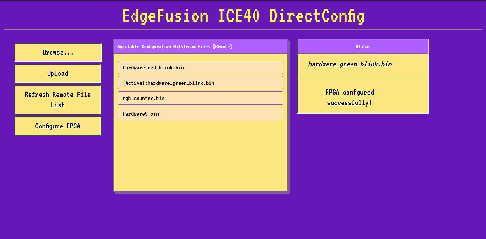

# ICE40UP5K Direct Configuration Tool & Web UI
This project implements APIs to load bitstream files from ESP32. ESP32 Stores Bitstream files in SPIFFS or SD card depending on your configuration. Web server created on ESP32 allowes you to load new bitstream files on esp32's local storage media and also allows you and applications on you esp32 to configure FPGA on the go!

Video Demo : https://www.youtube.com/watch?v=FyoyjnMNimQ

